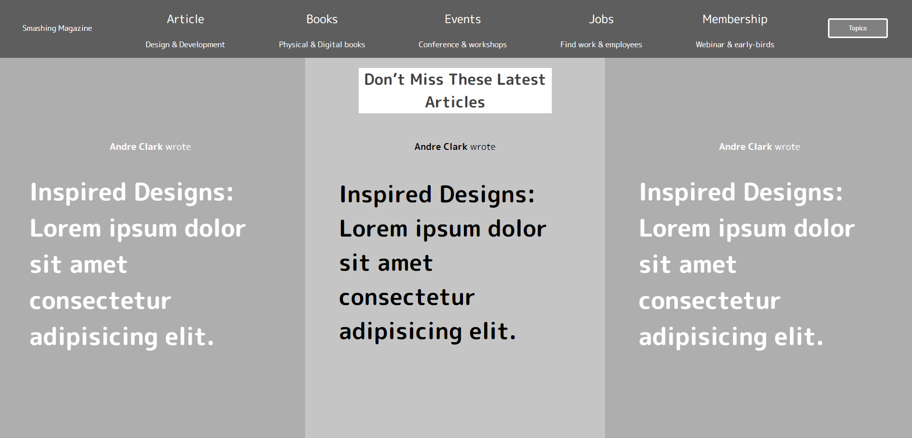

# Smashing_magazine_UI-UX
This is a microverse project to recreate the UI/UX for the smashing magazine. For the construction of this page we have used flexbox and CSS grid.

## Built With

- HTML
- CSS

## Live Demo

[Live Demo Link](https://rawcdn.githack.com/KossySteve/NewYorkTimes-Article-page-clone/7ec18f6b56ef578bf68cf69a446e2f760868e274/index.html)

## Authors

👤 **Ezeokwelume Kosisochukwu Stephen**

- Github: [@KossySteve](https://github.com/KossySteve)
- Twitter: [@EzeSteve3](https://twitter.com/EzeSteve3/)
- Linkedin: [linkedin](https://www.linkedin.com/in/steve-ez-b090ba198/)

👤 **Johann Alonso Rodríguez Vázquez**

- Github: [@JohannRodríguez](https://github.com/JohannRodriguez)
- Linkedin: [linkedin](https://www.linkedin.com/in/johann-alonso-rodr%C3%ADguez-v%C3%A1zquez-25b07719a/)

## 🤝 Contributing

Contributions, issues and feature requests are welcome!

Feel free to check the [issues page](issues/).

## Show your support

Give a ⭐️ if you like this project!
